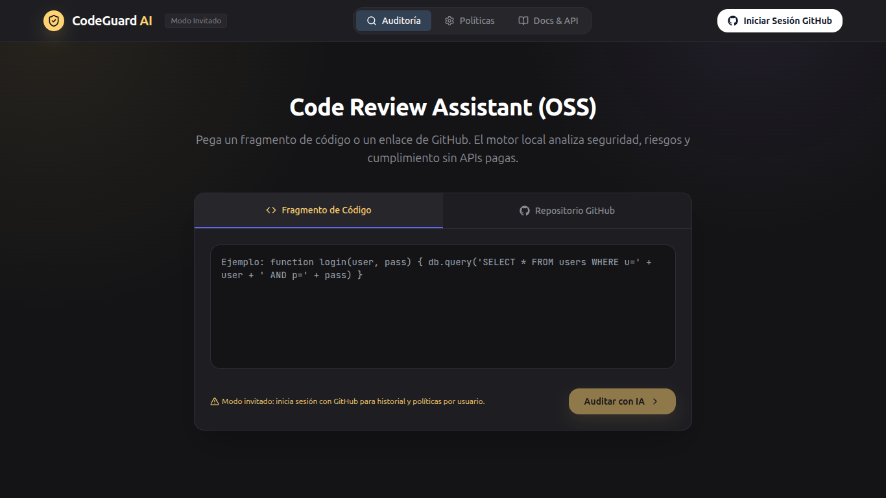
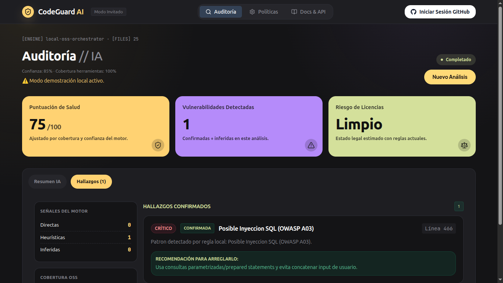

# CodeWard

**OSS Security Auditor**

CodeWard es un auditor OSS de seguridad y compliance para repositorios y snippets, en etapa MVP.
Su enfoque es entregar hallazgos accionables con evidencia trazable y una arquitectura backend real:
API + worker BullMQ integrado + cola + PostgreSQL + Redis.

## Demo

- App en vivo: https://codeward-ia.vercel.app
- API (Render Docker): https://codeward-api-docker.onrender.com

### Video demo

[](./public/demo.mp4)

Haz click en la imagen para abrir el video: [public/demo.mp4](./public/demo.mp4)

### Capturas

**Inicio**


**Resultado de auditoría**



## Propuesta de valor

- Escaneo de código con salida utilizable para desarrollo real (no solo una demo visual).
- Evidencia clasificada por tipo (`direct`, `heuristic`, `inferred`) para evitar falsas certezas.
- Flujo asíncrono con cola y persistencia para soportar análisis de repositorios completos.
- Exportes estándar (`SARIF`, `Markdown`, `JSON`) para integraciones futuras.

## Stack

- Frontend: React + Vite + Tailwind
- Backend: Node.js + Express
- Worker: BullMQ integrado en el proceso del API (modo free-friendly)
- DB: PostgreSQL
- Cola: Redis
- Explicacion opcional: Ollama local
- Auth: GitHub OAuth + session server-side

## Estado del analisis (honesto)

- `direct`: hallazgos confirmados por scanner/tool.
- `heuristic`: hallazgos por reglas locales regex.
- `inferred`: riesgos arquitectonicos inferidos por contexto.

Si un escaneo real falla, la UI muestra error. El modo demo con datos simulados es manual.
Si inicias sesión con GitHub, historial y políticas quedan aislados por usuario.

## Alcance actual del MVP

- Analiza snippets y repositorios GitHub.
- Calcula score de salud y score de confianza según cobertura real de scanners.
- Permite políticas por usuario (con OAuth GitHub) o por admin key en modo invitado.
- Expone endpoints para historial, estado, exportes y configuración de autenticación.

## Limitaciones actuales (transparentes)

- No reemplaza una auditoría de seguridad profesional de nivel enterprise.
- Parte del motor sigue siendo heurístico y puede producir falsos positivos/negativos.
- La profundidad de análisis depende de disponibilidad de herramientas OSS en runtime.
- El escaneo está optimizado para velocidad/costo en entorno free-tier, no para cobertura total ilimitada.

## Deteccion actual

- Heuristico local (siempre disponible)
- Gitleaks (si esta instalado en el host)
- Semgrep (si esta instalado en el host)
- OSV-Scanner (si esta instalado en el host)
- Trivy (si esta instalado en el host)

## Matriz de cobertura (honesta)

| Area | Detecta hoy | Tipo de evidencia |
| --- | --- | --- |
| Secretos hardcodeados | Regex local + Gitleaks | `heuristic` / `direct` |
| SAST codigo fuente | Regex local + Semgrep | `heuristic` / `direct` |
| Vulnerabilidades de dependencias | OSV-Scanner (+ Trivy opcional) | `direct` |
| Riesgos arquitectonicos (contexto README/codigo) | Reglas inferidas | `inferred` |
| Licencias | Regex local + Trivy | `heuristic` / `direct` |

Scanners requeridos para cobertura minima de repo: `gitleaks`, `semgrep`, `osv-scanner`.
Si faltan, el reporte marca cobertura incompleta y baja el score de confianza.

## Casos de uso recomendados

- Revisión inicial de riesgo en repositorios antes de refactor o onboarding técnico.
- Chequeo rápido de secretos, patrones inseguros y riesgo de dependencias.
- Generación de reportes compartibles para discusiones técnicas en equipo.
- Base OSS para evolucionar un flujo DevSecOps propio.

## Instalacion

```bash
pnpm install
cp .env.example .env
```

## Infra local

```bash
docker compose up -d
```

## Ejecutar

```bash
pnpm run dev:full
```

Comandos separados:

```bash
pnpm run api
pnpm run worker
pnpm run dev
```

En producción (sin watch):

```bash
pnpm run start:api
```

## GitHub OAuth (real)

1. Crea una OAuth App en GitHub.
2. Configura callback URL: `http://localhost:8787/auth/github/callback`
3. Completa en `.env`:

```bash
GITHUB_CLIENT_ID=...
GITHUB_CLIENT_SECRET=...
GITHUB_CALLBACK_URL=http://localhost:8787/auth/github/callback
FRONTEND_URL=http://localhost:5173
SESSION_SECRET=un-secreto-largo
```

Si no defines `GITHUB_CLIENT_ID` y `GITHUB_CLIENT_SECRET`, la app funciona en modo invitado.

## Variables de entorno

- `ADMIN_KEY`: opcional para editar políticas en modo invitado (`x-admin-key`)
- `SCAN_TIMEOUT_MS`: timeout para tareas externas/scanners
- `MAX_REPO_SIZE_KB`: limite de tamano de repo para escaneo
- `VITE_ADMIN_KEY`: key usada por UI para editar políticas en modo invitado local
- `CORS_ORIGINS`: orígenes permitidos para API
- `FRONTEND_URL`: URL del frontend para redirects OAuth
- `SESSION_SECRET`: secreto para cookies de sesión
- `GITHUB_CLIENT_ID`, `GITHUB_CLIENT_SECRET`, `GITHUB_CALLBACK_URL`: OAuth
- `GITHUB_TOKEN` (opcional): reduce limites de GitHub API
- `OLLAMA_MODEL`, `OLLAMA_URL` (opcionales)
- `REQUIRED_SCANNERS` (opcional): lista CSV de scanners requeridos (default: `gitleaks,semgrep,osv-scanner`)

## Deploy recomendado: Render + Supabase (Render Free)

Este repo ya incluye `render.yaml` para crear 1 servicio:

- `codeward-api` (web service, incluye worker integrado)

Flujo sugerido:

1. Crea proyecto en Supabase y copia `DATABASE_URL` (pooler o direct connection).
2. Crea Redis (Render Redis o Upstash) y copia `REDIS_URL`.
3. En Render, conecta este repo y usa `render.yaml`.
4. Configura en `codeward-api`:
   - `DATABASE_URL`
   - `REDIS_URL`
   - `SESSION_SECRET`
   - `ADMIN_KEY`
5. En `codeward-api` agrega además:
   - `FRONTEND_URL` (tu dominio Vercel)
   - `CORS_ORIGINS` (incluye tu dominio Vercel)
   - `GITHUB_CLIENT_ID`, `GITHUB_CLIENT_SECRET`, `GITHUB_CALLBACK_URL` (si usarás login GitHub)

Si solo usarás modo invitado por ahora, puedes dejar vacías las variables de GitHub OAuth.

## Deploy alternativo: Render (Docker con scanners instalados)

Si quieres cobertura real con `gitleaks + semgrep + osv-scanner` en producción, usa el `Dockerfile` incluido.

Pasos:

1. En Render crea un **nuevo Web Service** desde este repo.
2. Render detectará `Dockerfile` en la raíz y hará build Docker.
3. Configura variables:
   - `DATABASE_URL`
   - `REDIS_URL`
   - `SESSION_SECRET`
   - `ADMIN_KEY`
   - `FRONTEND_URL`
   - `CORS_ORIGINS`
   - `GITHUB_CLIENT_ID`
   - `GITHUB_CLIENT_SECRET`
   - `GITHUB_CALLBACK_URL`
4. Deploy.

Verificación rápida en runtime:

```bash
https://TU-API.onrender.com/api/health
```

Después de un scan de repo, revisa en respuesta `meta.tools` que incluya scanners OSS (`gitleaks`, `semgrep`, `osv-scanner`) cuando haya hallazgos o en warnings de cobertura.

## Vercel proxy (recomendado)

Este repo incluye `vercel.json` con rewrites para evitar cookies cross-site:

- `/api/*` -> `https://codeward-api.onrender.com/api/*`
- `/auth/*` -> `https://codeward-api.onrender.com/auth/*`

Con esto, en producción el frontend usa misma origin y no depende de third-party cookies del navegador.
En Vercel puedes dejar `VITE_API_URL` vacío o no definirlo.

Si activas este proxy, configura GitHub OAuth callback con dominio de Vercel:

- `https://codeward-ia.vercel.app/auth/github/callback`

## Endpoints

- `GET /api/health`
- `GET /api/me`
- `GET /auth/github`
- `GET /auth/github/callback`
- `POST /auth/logout`
- `POST /api/scans`
- `GET /api/scans/:scanId`
- `GET /api/scans/:scanId/export?format=json|sarif|markdown`
- `GET /api/history`
- `GET /api/policies`
- `PUT /api/policies` (sesión GitHub o `x-admin-key` en modo invitado)

## Exportes

- JSON
- SARIF 2.1.0
- Markdown

## E2E smoke test (remoto)

```bash
API_BASE_URL=https://codeward-api.onrender.com pnpm run test:e2e:remote
```

Valida flujo real: `health` -> crear scan -> polling -> export markdown.

## Licencia

MIT. Ver [LICENSE](./LICENSE).

## Comunidad

- Guía de contribución: [CONTRIBUTING.md](./CONTRIBUTING.md)
- Código de conducta: [CODE_OF_CONDUCT.md](./CODE_OF_CONDUCT.md)

## Roadmap

- Mejorar precisión del scoring y trazabilidad de hallazgos por herramienta.
- Reducir falsos positivos en detección heurística de licencias.
- Ampliar cobertura de tests E2E para sesión OAuth y aislamiento multiusuario.
- Fortalecer integración CI/CD para uso continuo en repositorios.
